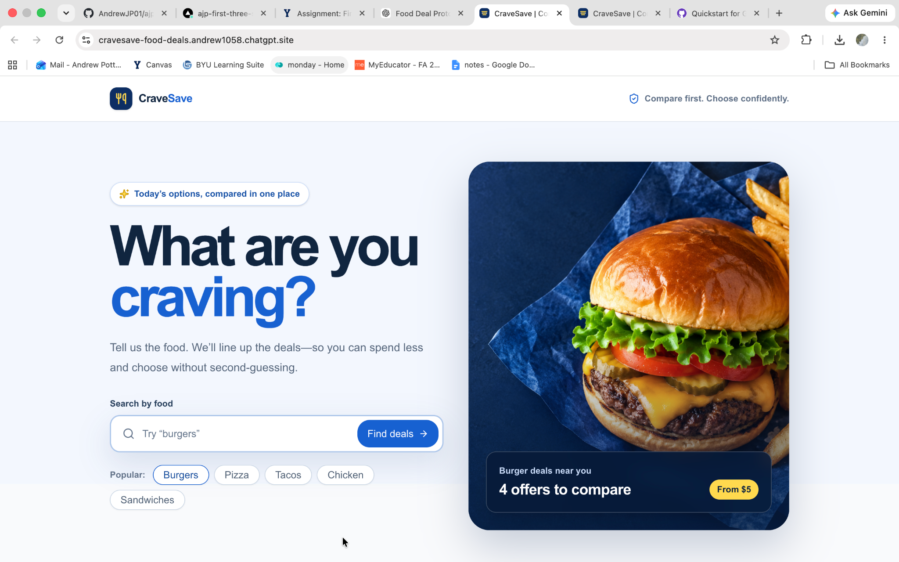
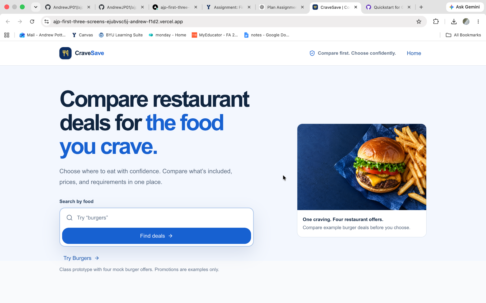
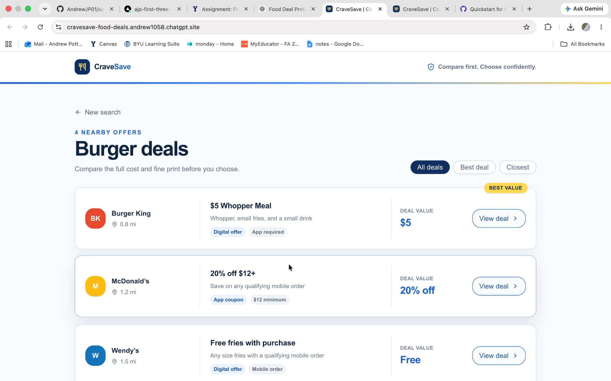
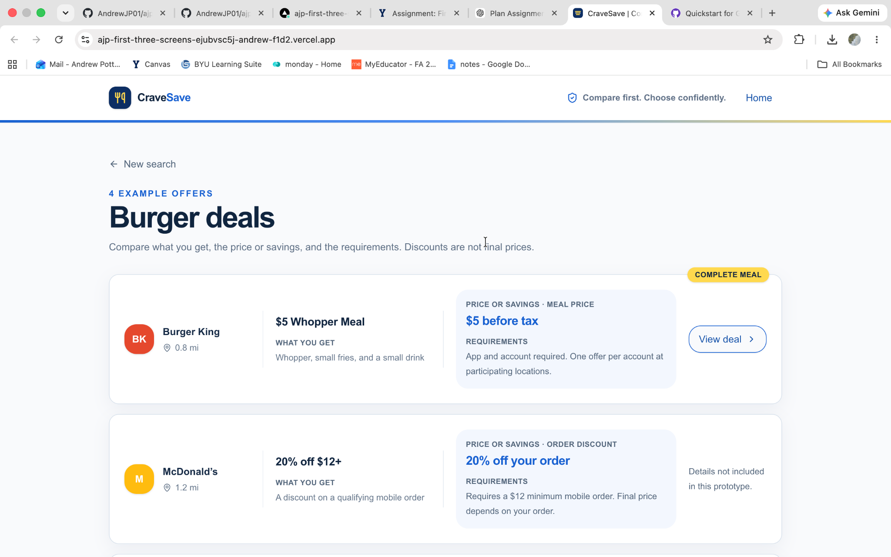
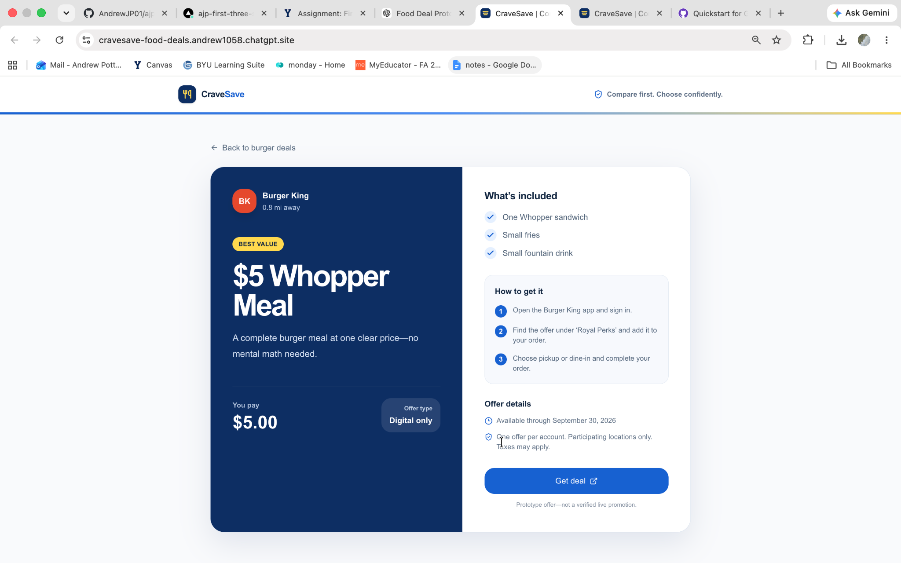
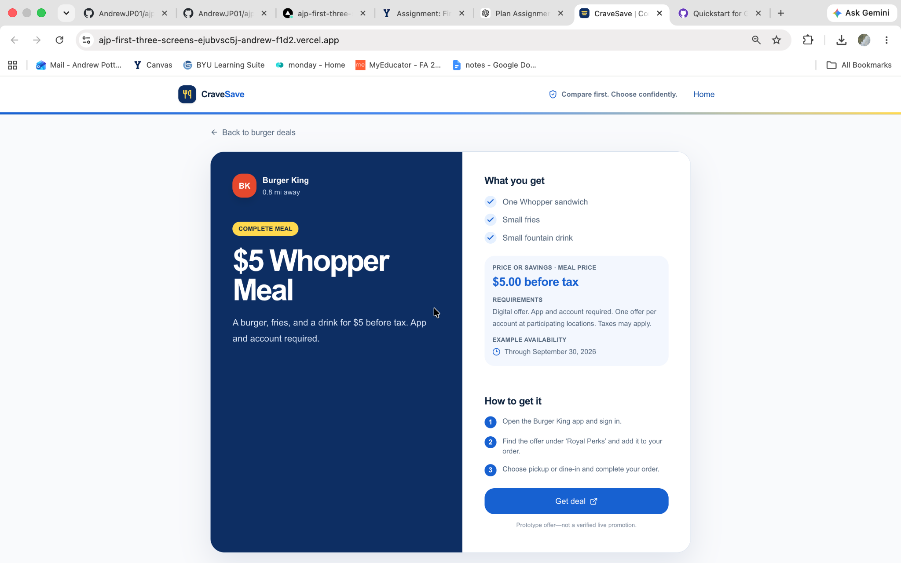

# CraveSave

CraveSave is a three-screen prototype that helps budget-conscious college students and young adults compare restaurant deals based on the type of food they are craving.

## 1. Need, Persona, Primary Capability, and Fundamental Value

**Need:** When college students and young adults know what type of food they want but are trying to spend less, finding the best deal requires checking multiple restaurant apps, websites, and coupon offers individually.

**Persona:** Budget-conscious college students and young adults who eat out a few times per week, often decide where to eat based on price, and are willing to choose between several restaurants serving the same type of food.

**Primary Capability:** Search for a type of food and compare currently available restaurant deals, coupons, and promotions in one place.

**Fundamental Value — Confidence:** Users can quickly choose where to eat knowing they have compared available deals instead of wondering whether they are missing a better option.

## 2. Three Screens

### Landing / Food Search

**Job:** Immediately communicate that users can search for a food they are craving and compare restaurant deals.

**Why it earned a slot:** This establishes CraveSave's primary capability and value before the user begins searching.

**Design question:** After seeing this screen for five seconds, will users understand that CraveSave helps them compare restaurant deals based on what they want to eat?

### Burger Deal Results

**Job:** Let users compare offers from multiple restaurants without opening each deal individually.

**Why it earned a slot:** This is the primary capability in action. Users can compare what they get, the price or savings, and requirements across restaurants.

**Design question:** Can users quickly compare restaurant options and understand which deal fits their needs without opening every offer?

### Deal Details

**Job:** Explain exactly what a selected offer includes and how to redeem it.

**Why it earned a slot:** It completes the flow by turning a comparison into an actionable choice.

**Design question:** Can users quickly understand what the offer includes, its requirements, and what they need to do to redeem it?

## 3. Design Question Plan

| Area | Question | Prediction |
| --- | --- | --- |
| **Need** | Think about the last time you wanted to eat out but also wanted to save money. How did you decide where to go, and did you look for any deals first? | I predict users will say they checked one or two restaurant apps, searched online, or chose somewhere they already knew had a deal because checking every restaurant takes too much effort. |
| **Value** | If you could see available deals from different restaurants all in one place, what would be most valuable about that to you? Why? | I predict users will mention saving money, saving time, or feeling confident that they found a good deal. This tests whether confidence is actually the fundamental value users experience. |
| **Persona** | How often are you deciding where to eat based on what deals or discounts you can find? What is usually going on when you're making that decision? | I predict this happens regularly for budget-conscious college students, especially when eating between classes, going out with friends, or wanting something quick without spending much. |
| **Capability** | I'm going to show you the home screen for five seconds, then hide it. Tell me what you think this website does. | I predict users will say something similar to, "You search for what food you want and it shows you deals at different restaurants." If they cannot identify that quickly, the landing screen is not signaling the primary capability strongly enough. |

## 4. Design Justification and First Read

### Landing Screen

At first glance, the revised landing screen signals the primary capability through the headline **"Compare restaurant deals for the food you crave."** The supporting line, **"Choose where to eat with confidence,"** connects that capability to the fundamental value of confidence. The search field and **Find deals** button receive the strongest interactive emphasis, while the burger image supports the food-search concept without competing with the main action.

Every major element supports the primary job. The headline explains the capability, the supporting copy communicates the value, the search controls provide the main action, and the smaller image reinforces the food context. Secondary elements have been reduced so they do not compete with the search flow.

### Gestalt Grouping

The results screen relies on **common region, proximity, and similarity**. Each restaurant's identity, offer, what the user gets, price or savings, requirements, and action are contained within one card. Repeating the same structure across cards makes the offers easier to scan and compare.

The detail screen uses the same principles. Information about what the user gets is grouped together, while the price or savings, requirements, and availability are placed in their own common region. Redemption instructions are grouped separately under **How to get it**. This lets users understand the offer and its conditions before acting.

### Staying on Mission and Navigation

Screens 2 and 3 remain focused on the craving-to-decision flow. The results screen supports comparison, while the details screen explains the selected offer and how to use it. A visible **Home** link provides a direct route to the landing screen from all three screens, while **New search** and **Back to burger deals** provide contextual navigation.

### Meaningful Revision: Before and After

After reviewing the AI's first output, I revised how users compare deals. Initially, meal prices, percentage discounts, and free items all appeared under the same **"Deal Value"** label. This use of similarity made fundamentally different types of offers appear directly comparable. I replaced the generic label with clearer descriptions of the type of price or savings and grouped each benefit with its requirements using **proximity** and **common region**.

I repeated this grouping on the detail screen and placed offer information before redemption instructions so users can understand the deal and its conditions before deciding how to act on it.

I also changed the landing headline from **"What are you craving?"** to **"Compare restaurant deals for the food you crave."** This makes the primary capability explicit at first glance. I reduced the image's visual prominence so it no longer competes with the primary search action and added a visible **Home** link across all three screens.

These revisions improve communication, visual hierarchy, navigation signaling, grouping, and comprehension rather than simply changing the prototype's appearance. The main revision was motivated by the design question: **Can users quickly compare restaurant options and understand which deal fits their needs without opening every offer?**

## Before and After

### Landing Screen — Before

### Landing Screen — After

### Results Screen — Before

### Results Screen — After

### Deal Details — Before

### Deal Details — After

The initial design visually grouped each restaurant well, but its information architecture made different types of deals appear more directly comparable than they really were. The revision preserves the strong card grouping while making the information within each card clearer and more consistent for comparison.
